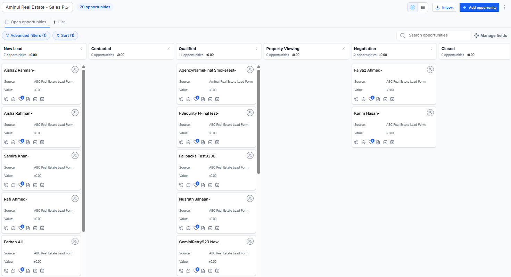

# 🏠 Aminul Real Estate — Automated Lead Management & Property Viewing System

> End-to-end CRM automation built with GoHighLevel, n8n, REST API, Webhooks, and Google Gemini AI.

## 📌 Project Overview

This project demonstrates an automated real estate lead management system designed to handle the customer journey from initial lead capture through qualification, property-viewing booking, and sales pipeline progression.

The system uses **GoHighLevel (GHL)** for CRM operations, sales pipeline management, workflows, follow-up, calendars, and appointments, while **n8n** handles validation, deduplication logic, advanced processing, API integration, and AI-powered lead intent assessment.

### 🔄 High-Level Flow

**Lead Form → GHL Contact → Opportunity → GHL Workflow → n8n → Validation → Deduplication → Budget Qualification → AI Intent Assessment → GHL Update → Property Viewing → Appointment → Pipeline Update**

## 🎯 Business Problems Addressed

- Manual lead management
- Slow lead follow-up
- Inconsistent lead qualification
- Duplicate-lead handling
- Poor sales pipeline visibility
- Manual property-viewing scheduling
- Disconnected CRM and appointment processes

## 📊 CRM Sales Pipeline

The CRM uses a structured sales pipeline to track each lead throughout the real estate sales journey.

### Pipeline Stages

**New Lead → Contacted → Qualified → Property Viewing → Negotiation → Closed**

Each stage represents a clear step in the sales process:

- **New Lead** — A newly captured inquiry enters the CRM.
- **Contacted** — The sales team has started communication with the lead.
- **Qualified** — The lead meets the required qualification criteria.
- **Property Viewing** — A property-viewing appointment has been scheduled.
- **Negotiation** — The lead attended the viewing and progressed to negotiation.
- **Closed** — Final stage for the completed sales process.

### 📸 Pipeline Overview

