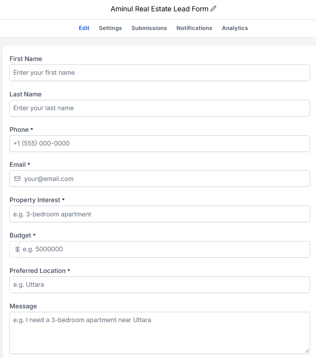
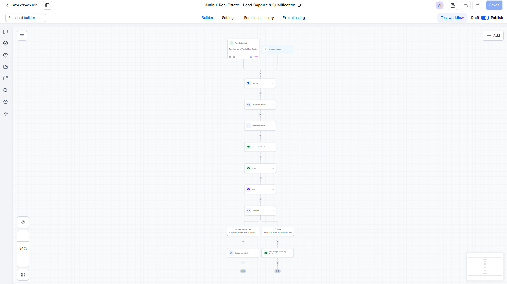
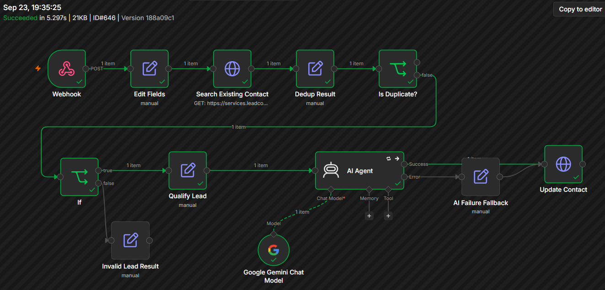
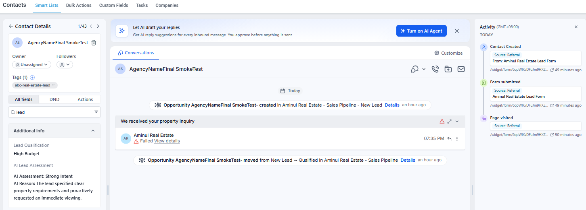
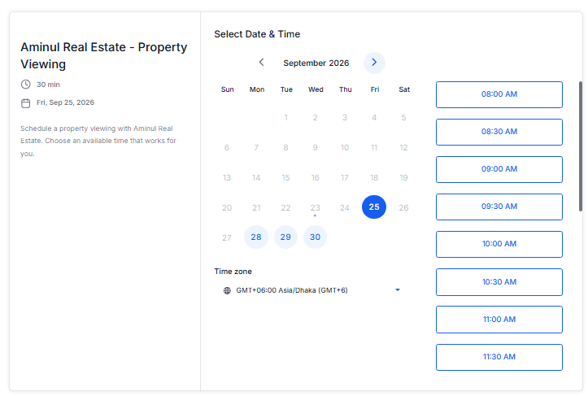
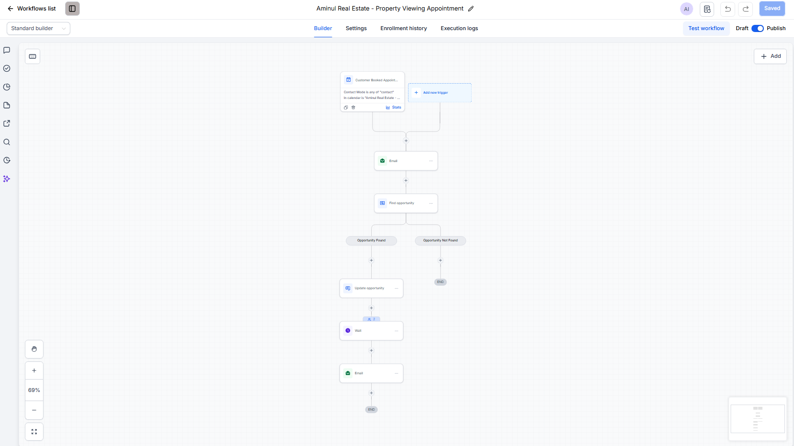
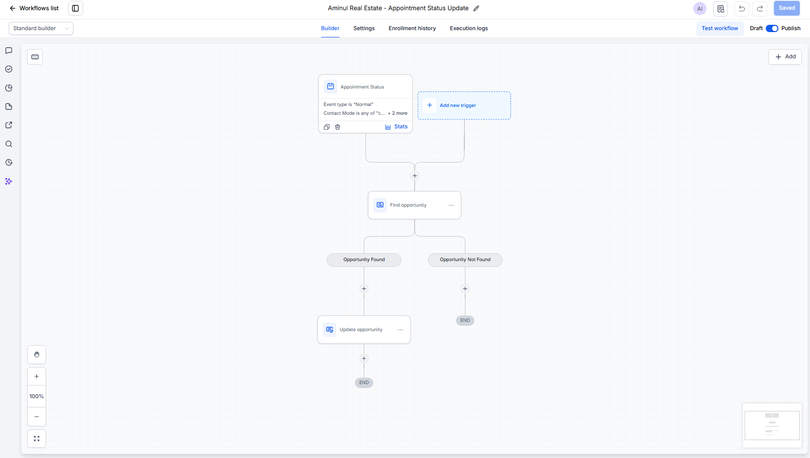
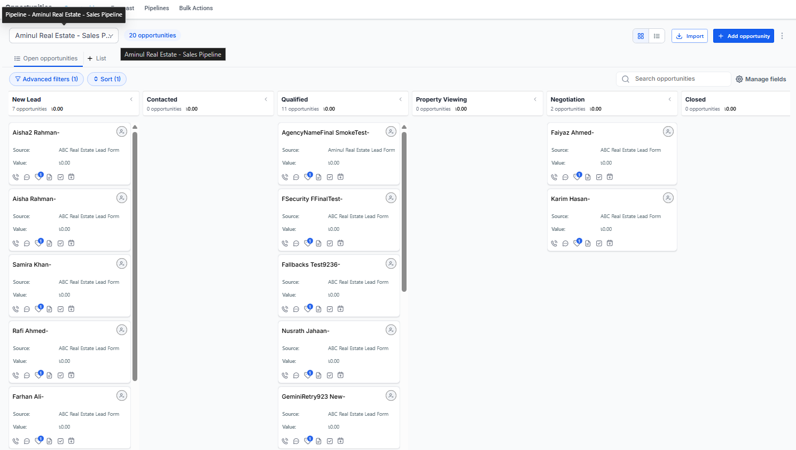
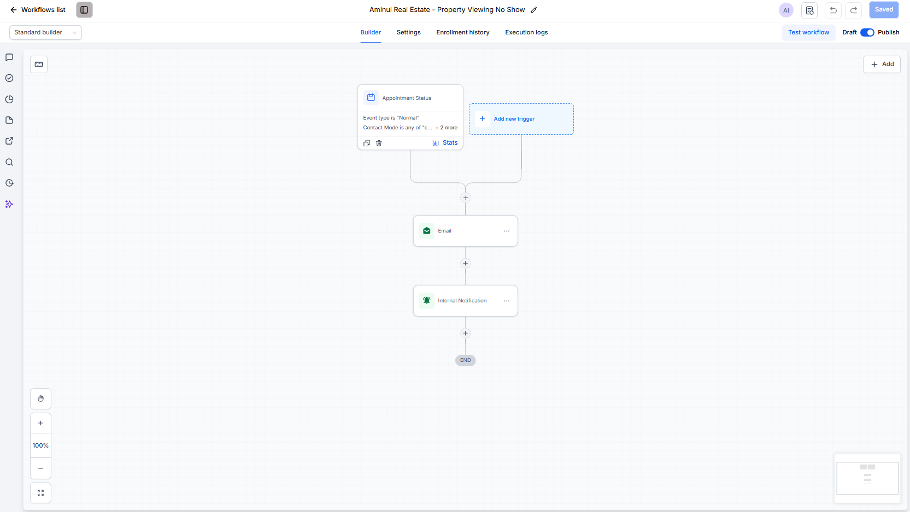
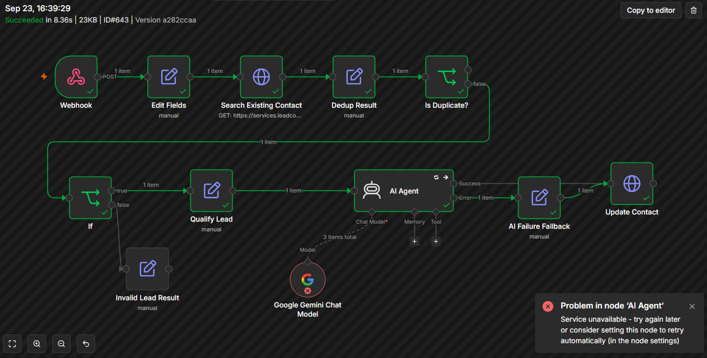

# 🏠 Aminul Real Estate — Automated Lead Management & Property Viewing System

> End-to-end CRM automation built with GoHighLevel, n8n, REST API, Webhooks, and Google Gemini AI.

## 📌 Project Overview

This project demonstrates an automated real estate lead management system designed to handle the customer journey from initial lead capture through qualification, property-viewing booking, and sales pipeline progression.

The system uses **GoHighLevel (GHL)** for CRM operations, sales pipeline management, workflows, follow-up, calendars, and appointments, while **n8n** handles validation, deduplication logic, advanced processing, API integration, and AI-powered lead intent assessment.

### 🔄 High-Level Flow

**Lead Form → GHL Contact → Opportunity → GHL Workflow → n8n → Validation → Deduplication → Budget Qualification → AI Intent Assessment → GHL Update → Property Viewing → Appointment → Pipeline Update**

## 🎯 Business Problems Addressed

- Manual lead management
- Slow lead follow-up
- Inconsistent lead qualification
- Duplicate-lead handling
- Poor sales pipeline visibility
- Manual property-viewing scheduling
- Disconnected CRM and appointment processes

## 📊 CRM Sales Pipeline

The CRM uses a structured sales pipeline to track each lead throughout the real estate sales journey.

### Pipeline Stages

**New Lead → Contacted → Qualified → Property Viewing → Negotiation → Closed**

Each stage represents a clear step in the sales process:

- **New Lead** — A newly captured inquiry enters the CRM.
- **Contacted** — The sales team has started communication with the lead.
- **Qualified** — The lead meets the required qualification criteria.
- **Property Viewing** — A property-viewing appointment has been scheduled.
- **Negotiation** — The lead attended the viewing and progressed to negotiation.
- **Closed** — Final stage for the completed sales process.

### 📸 Pipeline Overview


## 📝 Lead Capture & CRM Data

A dedicated GoHighLevel form captures the information required to process and qualify a real estate lead.

### Lead Information Collected

- First Name
- Last Name
- Phone
- Email
- Property Interest
- Budget
- Preferred Location
- Message

The real-estate-specific information is stored in custom CRM fields so it can be used later by GHL Workflows, n8n business logic, and AI qualification.

### Lead Capture Process

**Website / Campaign → GHL Form → Contact Record → Opportunity → Sales Pipeline**

After a successful form submission, the system can:

- Create or update the Contact
- Store property requirements in CRM fields
- Add the lead tag
- Create an Opportunity
- Place the Opportunity in the **New Lead** stage
- Start the lead-processing Workflow

### 📸 Lead Capture Form



## ⚙️ GoHighLevel Lead Capture & Qualification Workflow

The main GoHighLevel Workflow orchestrates the initial CRM automation after a lead submits the real estate inquiry form.

### Workflow Trigger

**Form Submitted → Aminul Real Estate Lead Form**

### Automation Sequence

1. **Add Contact Tag** — Identifies the contact as a real estate lead.
2. **Create Opportunity** — Creates an Opportunity in the Sales Pipeline at the **New Lead** stage.
3. **Send Lead to n8n** — Sends the lead data securely to the external processing workflow.
4. **Internal Notification** — Notifies the team about the new inquiry.
5. **Confirmation Email** — Sends an acknowledgement to the lead.
6. **Wait** — Controls follow-up timing.
7. **Budget Condition** — Evaluates the lead's budget.
8. **Pipeline / Follow-Up Action** — Qualified leads can progress while other leads follow the appropriate follow-up path.

### Duplicate & Re-entry Protection

The Workflow is configured to reduce unintended repeated processing:

- **Allow Re-entry:** Disabled
- **Allow Multiple Opportunities:** Disabled
- **Stop on Response:** Enabled

This helps prevent repeated messages and unnecessary duplicate Opportunities when the same Contact interacts with the automation again.

### 📸 Main GHL Workflow



## 🔗 n8n Integration & Lead Processing

GoHighLevel handles the CRM and customer-facing business process, while n8n handles the more advanced integration and processing logic.

The GHL Workflow sends lead data to an authenticated n8n Webhook. n8n then processes the lead before writing qualification results back to GoHighLevel through the REST API.

### Processing Flow

**GHL Workflow → Authenticated Webhook → Normalize Data → Search Existing Contact → Deduplication Check → Validation → Budget Qualification → AI Intent Assessment → GHL API Update**

### n8n Responsibilities

✅ **Data Normalization**  
Incoming GHL data is mapped into a consistent structure for downstream processing.

✅ **Existing Contact Lookup**  
The workflow searches GoHighLevel for the corresponding Contact before continuing.

✅ **Deduplication Logic**  
Incoming and existing Contact information is compared to reduce unintended duplicate processing.

✅ **Validation**  
Required values such as Contact ID, email, and valid budget data are checked before qualification.

✅ **Deterministic Qualification**  
Budget qualification is handled with explicit business rules rather than relying on AI.

Example classification:

- Budget ≥ 5,000,000 → **High Budget**
- Budget below threshold → **Standard Budget**

✅ **AI Intent Assessment**  
Google Gemini analyzes the lead's inquiry and classifies intent as:

- Strong Intent
- Moderate Intent
- Weak Intent

AI is used for interpreting lead intent, while deterministic business rules remain responsible for budget qualification.

✅ **CRM Write-Back**  
The final qualification and AI assessment are written back to the corresponding GoHighLevel Contact through the REST API.

### 📸 n8n Lead Processing Workflow



## 🤖 AI Qualification & CRM Write-Back

After validation and rule-based qualification, the lead is analyzed for purchase intent using Google Gemini.

The AI assessment is intentionally separated from deterministic business rules:

- **Budget Qualification** → Rule-based logic
- **Lead Intent Assessment** → AI analysis

This keeps critical business decisions predictable while using AI where interpretation of unstructured lead messages is useful.

### Example Processed Lead

For a successfully processed test lead:

- **Budget:** 6,500,000
- **Lead Qualification:** High Budget
- **AI Lead Assessment:** Strong Intent
- **Pipeline Progression:** New Lead → Qualified

The qualification and AI assessment are written back to custom fields on the GoHighLevel Contact record.

This allows the sales team to see the processed lead intelligence directly inside the CRM without opening n8n.

### 📸 AI Qualification Result in GoHighLevel



## 📅 Property Viewing Calendar & Appointment Automation

Qualified leads can schedule a property viewing through a dedicated GoHighLevel booking calendar.

### Calendar Configuration

The **Aminul Real Estate - Property Viewing** calendar provides:

- 30-minute property-viewing appointments
- Available date and time-slot selection
- Customer self-booking
- Appointment data connected directly to the CRM

This removes unnecessary back-and-forth communication when scheduling property viewings.

### 📸 Property Viewing Booking Calendar



### Booking Automation

When a customer books a property viewing, a dedicated GHL Workflow handles the appointment process:

**Customer Booked Appointment → Confirmation Email → Find Opportunity → Update Opportunity → Wait → Reminder Email**

The workflow searches for the lead's existing open Opportunity before updating the sales process.

If the Opportunity is found:

1. The Opportunity is moved to **Property Viewing**
2. The customer receives booking confirmation
3. The workflow waits until the configured reminder time
4. A property-viewing reminder is sent before the appointment

If no matching Opportunity is found, the workflow ends without creating an unintended duplicate Opportunity.

### 📸 Property Viewing Automation



## 🔄 Appointment Status & Pipeline Progression

The automation continues after a property-viewing appointment is booked.

Instead of requiring the sales team to manually update the CRM after every appointment, GoHighLevel uses appointment status changes to control the next stage of the Opportunity.

### Customer Attended the Viewing

When the appointment status is updated to **Showed**, the workflow:

**Appointment Status: Showed → Find Opportunity → Update Opportunity → Negotiation**

The workflow first searches for the corresponding open Opportunity. If found, the Opportunity is automatically moved to the **Negotiation** stage.

### 📸 Appointment Status Automation



### 📸 Result in the Sales Pipeline

The following test demonstrates the Opportunity progressing to the **Negotiation** stage after the property-viewing lifecycle.



## 🚫 No-Show Follow-Up

A separate workflow handles leads who do not attend their scheduled property viewing.

When an appointment receives the configured **No Show** status, the workflow can:

- Send a follow-up email to the lead
- Notify the internal team
- Keep the missed appointment visible for human follow-up

This separates the normal attended-appointment path from the exception-handling path.

### 📸 No-Show Automation



## 🛡️ Error Handling & AI Failure Fallback

External AI services can temporarily fail, time out, or become unavailable. The automation is designed so that an AI failure does not unnecessarily break the entire lead-processing workflow.

### AI Reliability Strategy

The AI processing step includes:

- **Retry on Fail:** Enabled
- **Maximum Attempts:** 3
- **Wait Between Attempts:** 3 seconds
- **Fallback Path:** Enabled

If the AI assessment still fails after the retry attempts, the workflow continues through a fallback path instead of stopping the complete CRM process.

### Fallback Result

The Contact can be updated with:

**AI assessment unavailable - manual review recommended**

This preserves the deterministic lead qualification while clearly indicating that the AI assessment requires human review.

### Why This Matters

The architecture separates:

**Business-Critical Logic → Deterministic Rules**

from:

**AI Interpretation → Failure-Tolerant Enhancement**

Therefore, temporary AI availability issues do not have to prevent the lead from continuing through the CRM process.

### 📸 Tested AI Failure & Fallback Path

The following test intentionally triggered an AI failure. The AI step failed after retry attempts, while the fallback path and CRM update completed successfully.



## 🧪 Testing & Validation

The system was tested across multiple lead-processing and appointment scenarios to verify both the normal business flow and selected failure paths.

| Test Scenario | Expected Result | Status |
|---|---|---|
| Valid high-budget lead | Contact and Opportunity created, lead processed through n8n, qualification written back to GHL | ✅ Tested |
| High-budget qualification | Lead classified as **High Budget** | ✅ Tested |
| Low-budget lead | Lead follows the lower-budget workflow path | ✅ Tested |
| Missing / invalid required data | n8n validation rejects the lead from the normal qualification path | ✅ Tested |
| AI intent assessment | Gemini assessment written back to the GHL Contact | ✅ Tested |
| Property-viewing booking | Appointment created and Opportunity moved to **Property Viewing** | ✅ Tested |
| Appointment marked Showed | Opportunity moved from **Property Viewing → Negotiation** | ✅ Tested |
| No-Show workflow | Follow-up workflow triggered for the configured No Show status | ✅ Tested |
| AI service failure | Retry/fallback path continues processing and updates the CRM | ✅ Tested |
| Re-submission of the same Contact | GHL workflow re-entry protection prevents repeated processing | ✅ Tested |
| True duplicate-contact branch | Deduplication logic implemented | ⚠️ Implemented, not fully E2E verified |
| Scheduled reminder delivery | Reminder action configured relative to appointment time | ⚠️ Configured, delivery not independently observed |

### Final Smoke Test

After the project branding and webhook-secret rotation were completed, a fresh dummy lead was submitted through the final system.

The test successfully verified:

**Form Submission → GHL Contact → Opportunity → Authenticated Webhook → n8n Processing → Validation → Qualification → AI Assessment → GHL CRM Update → Qualified Pipeline Stage**

The final n8n execution completed successfully, confirming that the core integration remained functional after the final configuration changes.


## 🔐 Security & Production Considerations

The integration was designed with basic production security practices in mind.

### Webhook Security

Communication from GoHighLevel to n8n uses an **authenticated webhook** rather than an unrestricted public webhook.

Authentication credentials and secret values are never included in this repository.

### API Authentication

n8n communicates with GoHighLevel through authenticated API access.

The integration uses only the permissions required for the implemented workflow, including access to:

- Contact lookup
- Contact updates
- Custom field information

API credentials are stored in the automation platform's credential management system rather than hard-coded into public documentation.

### Secret Management

The following values must never be committed to a public repository:

- Private Integration Tokens
- API keys
- OAuth client secrets
- Access or refresh tokens
- Webhook authentication secrets
- Authorization headers
- Passwords or OTPs
- Real customer confidential data

During development, the webhook authentication secret was rotated and the integration was retested successfully afterward.

### n8n Workflow Export Safety

Before publishing an n8n workflow export, the JSON should be reviewed for sensitive or environment-specific information.

Important strings and fields to inspect include:

`Authorization`, `Bearer`, `token`, `secret`, `apiKey`, `x-ghl-webhook-secret`, static headers, webhook URLs, credential references, and environment-specific identifiers.

A workflow export should only be published after this security review.

### Production Deployment Checklist

Before deploying a similar system for a real client:

- Audit existing GHL Pipelines, Workflows, Forms, Calendars, and integrations
- Use proper Sub-account/User permissions instead of shared passwords
- Store credentials in secure credential managers
- Apply least-privilege API permissions
- Use authenticated Webhooks
- Test with dummy or sandbox data before production
- Verify duplicate and idempotency behavior
- Review retry and failure-handling paths
- Add appropriate logging and monitoring
- Validate consent and communication-compliance configuration
- Document dependencies before handover
- Revoke or rotate credentials that are no longer required

**Security Note:** No authentication secrets, API tokens, or real customer credentials are intentionally included in this repository.

## 🏗️ System Architecture

The solution separates CRM operations from advanced integration and AI processing so that each platform handles the responsibilities it is best suited for.

### Architecture Flow

```text
Lead Source / Website
        ↓
GoHighLevel Form
        ↓
Contact + Opportunity
        ↓
GHL Lead Workflow
        ↓
Authenticated Webhook
        ↓
n8n
 ├── Data Normalization
 ├── Contact Lookup
 ├── Deduplication Logic
 ├── Validation
 ├── Budget Qualification
 └── Gemini AI Intent Assessment
        ↓
GoHighLevel REST API
        ↓
Contact Qualification Update
        ↓
Qualified Opportunity
        ↓
Property Viewing Calendar
        ↓
Appointment Workflows
        ↓
Property Viewing → Negotiation

| Component                 | Responsibility                                                                                                |
| ------------------------- | ------------------------------------------------------------------------------------------------------------- |
| **GoHighLevel**           | Contacts, Opportunities, Pipeline, Forms, Workflows, Follow-Up, Calendar and Appointments                     |
| **n8n**                   | Integration orchestration, validation, deduplication logic, transformation, business logic and error handling |
| **Google Gemini AI**      | Lead intent assessment from inquiry information                                                               |
| **GHL REST API**          | Writing processed qualification results back to the CRM                                                       |
| **Authenticated Webhook** | Secure event/data transfer from GHL to n8n                                                                    |

This separation keeps standard CRM operations inside GoHighLevel while using n8n only where more advanced processing or external integration is required.

## 📦 n8n Workflow Import & Configuration

A sanitized version of the n8n workflow is included in this repository:

`n8n/aminul-real-estate-ghl-lead-processing-sanitized.json`

The public workflow preserves the automation logic while removing environment-specific credentials and identifiers.

### Import

1. Open n8n.
2. Create a new workflow or use the workflow import option.
3. Import:

   `aminul-real-estate-ghl-lead-processing-sanitized.json`

4. Configure the required credentials and environment-specific values before activating the workflow.

### Required Configuration

Replace the following placeholders with values from your own environment:

| Placeholder | Configuration |
|---|---|
| `YOUR_GHL_LEAD_WEBHOOK_PATH` | Webhook path used for receiving lead data from GoHighLevel |
| `YOUR_GHL_LOCATION_ID` | GoHighLevel Sub-account / Location ID |
| `YOUR_LEAD_QUALIFICATION_CUSTOM_FIELD_ID` | GHL Custom Field ID for deterministic lead qualification |
| `YOUR_AI_ASSESSMENT_CUSTOM_FIELD_ID` | GHL Custom Field ID for the AI assessment |

### Credentials

After importing, configure credentials inside n8n for:

- Webhook Header Authentication
- GoHighLevel API / Private Integration authentication
- Google Gemini API authentication

Do not hard-code secrets directly into the workflow.

### GoHighLevel API Permissions

The GHL integration used by this project requires the permissions necessary for the implemented Contact operations and Custom Field access.

Configure permissions according to the operations used in your own environment and follow the principle of least privilege.

### Important

The exported workflow is provided as a sanitized implementation reference. Environment-specific credentials, IDs, and authentication values must be configured before the workflow can run successfully.

After configuration, test the workflow with dummy data before connecting it to a production GHL account.

## 📁 Project Structure

```text
aminul-real-estate-crm-automation/
│
├── README.md
│
├── docs/
│   └── screenshots/
│       ├── 01-aminul-real-estate-sales-pipeline.png
│       ├── 02-aminul-real-estate-lead-capture-qualification-workflow.png
│       ├── 03-aminul-real-estate-lead-capture-form.png
│       ├── 04-aminul-real-estate-n8n-lead-processing-workflow.png
│       ├── 05-aminul-real-estate-ai-qualification-crm-update.png
│       ├── 06-aminul-real-estate-property-viewing-booking-calendar.png
│       ├── 07-aminul-real-estate-property-viewing-automation.png
│       ├── 08-aminul-real-estate-appointment-status-pipeline-update.png
│       ├── 09-aminul-real-estate-no-show-follow-up-workflow.png
│       ├── 10-aminul-real-estate-appointment-to-negotiation-result.png
│       └── 11-aminul-real-estate-ai-failure-fallback.png
│
└── n8n/
    └── aminul-real-estate-ghl-lead-processing-sanitized.json
```

### Repository Contents

- **`README.md`** — Complete project architecture, implementation, testing, security, and setup documentation.
- **`docs/screenshots/`** — Visual evidence of the GHL and n8n implementation and test results.
- **`n8n/`** — Sanitized n8n workflow that can be imported and configured in another environment.

The repository intentionally excludes API tokens, webhook secrets, authentication credentials, and real customer confidential data.

## ⚠️ Known Limitations & Production Notes

This project was built and tested as a portfolio implementation using controlled dummy data. The core CRM, integration, AI qualification, and appointment flows were tested, while several production considerations would require additional validation before deployment for a real business.

### Known Limitations

- **True Duplicate Contact Scenario**  
  Deduplication logic is implemented by comparing the incoming Contact ID with the Contact returned by the GHL duplicate-contact lookup. The normal non-duplicate path was verified, but a true duplicate-contact scenario was not fully tested end-to-end.

- **Scheduled Reminder Delivery**  
  The property-viewing workflow includes a reminder action scheduled relative to the appointment time. The configuration was verified, but the actual scheduled reminder delivery was not independently observed during the lab testing window.

- **Consent & Communication Compliance**  
  The demo form contained GHL-generated consent placeholders that require business-specific compliance configuration before production use. Consent wording, messaging permissions, and applicable communication requirements should be reviewed for the client's actual business and jurisdiction.

- **Email Deliverability**  
  Dummy/example contact data was used during testing. Workflow execution should not be interpreted as verification of production email deliverability. A real deployment should configure and verify the appropriate sending domain/provider and email deliverability setup.

- **Environment-Specific Configuration**  
  The public n8n workflow is sanitized. GHL Location IDs, Custom Field IDs, authentication credentials, webhook configuration, and API credentials must be configured for the target environment.

### Before Production Deployment

A real client deployment should include:

1. Existing GHL account and automation audit
2. Requirement and process validation
3. Production-specific field and pipeline mapping
4. Duplicate and idempotency testing
5. Email and communication-channel testing
6. Consent and compliance review
7. Credential and permission review
8. Failure-path and retry testing
9. Logging and monitoring strategy
10. User acceptance testing before production release

## 💼 Skills & Freelance Services Demonstrated

This project demonstrates practical CRM automation and integration skills that can be applied to real client projects.

### GoHighLevel CRM & Automation

- CRM Contact and Custom Field configuration
- Sales Pipeline and Opportunity management
- Lead Capture Forms
- Workflow Triggers, Conditions, Waits, and Actions
- Lead follow-up automation
- Duplicate and re-entry protection
- Calendar and appointment automation
- Appointment-status-based Pipeline updates

### n8n Integration & Automation

- GHL → n8n Webhook integration
- Data mapping and normalization
- Lead validation
- Deduplication logic
- Rule-based business logic
- REST API integration
- GHL Contact lookup and update
- Error handling and fallback paths

### AI Automation

- Google Gemini integration with n8n
- AI-powered lead intent assessment
- Separation of deterministic business rules from AI decisions
- AI retry and failure fallback
- Human-review fallback strategy

### Client Services This Architecture Can Support

- **GoHighLevel CRM & Sales Pipeline Setup**
- **GHL Lead Capture & Follow-Up Automation**
- **GHL Workflow Automation**
- **GHL Calendar & Appointment Automation**
- **GoHighLevel + n8n Integration**
- **Webhook & REST API Integration**
- **AI Lead Qualification Automation**
- **CRM Automation Testing & Troubleshooting**
- **Existing GHL Automation Audit & Improvement**

### Typical Client Deliverables

Depending on project scope, a similar implementation can include:

- Configured CRM fields and Pipeline
- Lead Capture Form
- Automated lead-processing Workflows
- Follow-up automation
- Booking Calendar and appointment Workflows
- n8n integration workflow
- API and Webhook configuration
- AI qualification logic
- Error and fallback handling
- End-to-end testing
- Implementation documentation and handover notes
